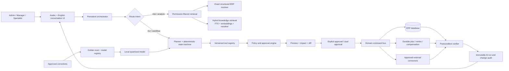

# HATAB Local AI Operations Platform

## Deep audit and implementation plan

**Audit date:** 2026-09-05  
**Scope:** HATAB website, ERP, executive assistant, local model runtime, data-management layer, and every currently exposed administrative domain.

---

## 1. Executive verdict

The current executive assistant is a useful **safe preview/apply helper**, but it is not yet an internal AI operations platform. It can extract and execute a bounded set of single-step commands. The requested objective is materially larger:

> A bilingual, persistent, locally hosted operations agent that understands the entire ERP, answers questions from trusted data, builds multi-step plans, asks for clarification when necessary, obtains the correct approvals, executes typed operations, verifies every result, and leaves a complete audit trail.

The correct target is **not a model with direct database access**. The model must be the planner and language interface. A deterministic control plane must own authorization, validation, transactions, idempotency, backups, execution, and verification.

The current foundation should be retained:

- local-only model endpoint;
- deterministic parsing and server-side grounding;
- signed, short-lived preview plans;
- before/after field preview;
- explicit action selection and confirmation;
- transactional execution, backup creation, and audit records;
- stale-state checks and protections around delivered items.

However, model tuning should pause until the command registry, orchestration contract, policy model, and golden evaluation set are versioned. Training the existing contract further would optimize the wrong abstraction.

---

## 2. What “complete” means

The finished system must support five modes through one assistant:

1. **Ask:** answer operational questions with record-level evidence and citations.
2. **Analyze:** calculate summaries, exceptions, forecasts, and recommended next actions without mutating data.
3. **Act:** create, edit, remove, reorder, publish, import, export, or otherwise control one domain through typed tools.
4. **Orchestrate:** execute a dependency-aware workflow spanning several ERP domains.
5. **Monitor:** create a persistent job, report progress, detect failure, retry safely, and verify the final business outcome.

A request such as:

> “العملاء الجدد هم فلان وفلان، الطلبات بالكود كذا، تتعمل عند مصنع كذا، اعمل المهام ومواعيد التسليم”

must become a reviewable plan such as:

1. resolve or create clients;
2. resolve products by SKU;
3. resolve the supplier/factory;
4. create projects and project items;
5. create supplier orders and order items;
6. calculate target dates from lead times;
7. create assigned follow-up tasks;
8. preview totals, ambiguities, and warnings;
9. request the appropriate approval;
10. execute atomically where possible;
11. verify all created relationships and report exact IDs.

This is a workflow engine using an LLM—not a large prompt wrapped around CRUD endpoints.

---

## 3. Evidence from the current system

### 3.1 ERP surface

The Prisma schema contains 28 models spanning core business, content, analytics, transfer, and audit entities:

- clients, projects, project items;
- suppliers, supplier orders, order items;
- categories, redirects, collections, catalog items, product families, product assets, tag groups, and tags;
- technicians, tasks, quotes, quote items, payments, and portfolio projects;
- users, settings, site content;
- import/export jobs, issues, and change audits;
- analytics sessions and events.

The admin UI exposes 17 operational areas: dashboard, assistant, projects, catalog, data quality, content, SEO, data management, categories, collections, suppliers, quotes, logistics, tasks, reports, analytics, and security.

There are 56 API route files. A source inventory found 52 `POST`/`PUT`/`PATCH`/`DELETE` handlers across 41 of those files. This is a broad ERP surface, not a small order-entry application.

### 3.2 Assistant tool coverage

The assistant currently declares 14 action kinds:

- create/update/delete client;
- create an order bundle;
- update/delete project and update project status;
- add/update/remove a project item;
- create/update/delete a task;
- update supplier-order status.

That covers part of four operational domains. It does not cover the majority of the admin surface.

| Domain | Read support | Write support | Audit result |
|---|---:|---:|---|
| Clients | Partial | Create/update/delete | Partial |
| Projects and project items | Partial | Core subset | Partial |
| Tasks | Partial | Create/update/delete | Partial |
| Supplier orders | Partial | Status and bundle path only | Partial |
| Suppliers | Name resolution only | None | Missing |
| Catalog/products/media | Limited lookup | None | Missing |
| Categories and redirects | None | None | Missing |
| Collections and ordering | None | None | Missing |
| Product families/data quality/merge | None | None | Missing |
| Quotes and conversion | None | None | Missing |
| Payments/accounting | None | None | Missing |
| Technicians/logistics/dispatch | None | None | Missing |
| Portfolio | None | None | Missing |
| Website content/banners | None | None | Missing |
| SEO/GEO | None | None | Missing |
| Reports and analytics | None | None | Missing |
| Import/export/backup/restore | None | None | Missing |
| Users/security/settings | None | None | Missing |

### 3.3 Current model is not trained for the declared contract

The active runtime advertises the expanded 14-action vocabulary, but the stored dataset and adapter tell a different story:

- `local-ai/data/manifest.json`: 1,380 train rows and 180 evaluation rows from the original five-action dataset;
- the active v2 adapter resumed from the old adapter;
- its final stage used 225 rows, all selected as `CREATE_ORDER_BUNDLE`;
- it ran only 60 optimizer steps in that stage;
- its manifest therefore does not demonstrate training on the new nine action kinds.

The current training file contains the following action examples (rows that intentionally return only `unparsed` are not included in these counts):

| Action in stored training data | Examples |
|---|---:|
| `CREATE_ORDER_BUNDLE` | 454 |
| `CREATE_CLIENT` | 216 |
| `ADD_PROJECT_ITEM` | 193 |
| `CREATE_TASK` | 190 |
| `UPDATE_PROJECT_STATUS` | 164 |
| All nine newly declared action kinds | 0 |

This is contract drift: TypeScript, the Python prompt, the Python allowlist, the dataset generator, the evaluator, and the adapter are not guaranteed to represent the same tool schema.

A direct live extraction benchmark on 2026-09-05 confirms the problem. For a simple project-item quantity update, the 0.6B runtime took roughly 43 seconds and returned the correct core values plus an illegal field. The TypeScript contract rejected the result, which is safe, but it proves that expanding the runtime allowlist did not teach the adapter the expanded schema.

The stored evaluation reports are also too weak for release decisions. One report contains only 12 samples and records 100% JSON validity and 91.7% action-kind accuracy, yet its own completions contain invented/wrong keys such as `orderName`, `supplierName`, `orderQuantity`, and `clientProductCode`. The smaller prompt check contains only four samples, with 75% contract validity and 50% exact match. These results measure smoke-test behavior, not whole-ERP operational reliability.

### 3.4 Retrieval is bounded lookup, not a complete RAG layer

The current retrieval code is useful and should remain. It performs deterministic keyword and identifier matching over a bounded set of entities, including IDs, phone numbers, SKUs, and supplier phrases. It is safer for live records than approximate vector search.

It is not yet a full retrieval system because it lacks:

- complete entity coverage;
- full-text or lexical ranking across business knowledge;
- embeddings and reranking;
- SOPs, policies, workflow rules, schema documentation, and product knowledge;
- record snapshots/citations attached to a plan;
- permission-filtered retrieval;
- freshness and provenance metadata.

Live ERP records and unstructured knowledge must remain separate retrieval lanes.

### 3.5 No persistent agent state

The current UI is a request → preview → apply flow. There are no persistent entities for:

- conversations and messages;
- runs and workflow steps;
- tool calls and their results;
- clarification questions;
- approvals;
- user corrections and model feedback;
- model, prompt, tool-schema, or retrieval versions.

Consequently, the system cannot reliably resume a workflow, explain its history, learn from an approved correction, or distinguish a new command from a follow-up referring to an earlier result.

### 3.6 Authorization is too coarse for full control

The assistant currently allows both `ADMIN` and `MANAGER`. That is acceptable for the existing narrow helper, but insufficient for a full operations platform. The system lacks:

- per-tool scopes;
- record ownership or branch/project scope;
- field-level restrictions;
- financial limits;
- bulk-operation limits;
- publish/restore/security-specific authority;
- dual approval;
- step-up authentication for critical actions.

Several ordinary CRUD APIs use the basic session check, whereas assistant and data-management routes use a live-session check. A future agent must not call the existing HTTP routes indiscriminately. UI routes, public APIs, imports, and AI tools should share the same domain command services and policy engine.

### 3.7 Data management is the strongest reusable subsystem

The data-management layer already has an allowlisted registry covering 24 spreadsheet modules, validation, dry runs, logical backups, transaction boundaries, restore checks, and change audits. This is the best starting point for a canonical schema registry.

It should be generalized into reusable domain commands rather than duplicated inside AI-specific code.

### 3.8 Runtime and hardware constraints

The current machine has approximately 16 GB RAM, a four-core/eight-thread Intel CPU, integrated graphics, and limited free space on `C:`. The current PyTorch CPU service loads Qwen3-0.6B in float32. Even this model is too slow on the live free-form path for an interactive operational agent.

Local inference remains realistic with a quantized runtime, but serious tuning of a larger candidate should run on a separate GPU machine using synthetic or redacted data. The resulting quantized artifact can then be deployed locally.

The local model endpoint is loopback-only, but no shared secret is configured in the current environment. Loopback is a useful boundary, not authentication; the service still needs a secret, request limits, schema version checks, and health/version reporting.

---

## 4. Root causes

The system feels like a placeholder because of architectural gaps, not merely model size.

1. **Action definitions are duplicated.** Tool contracts exist independently in TypeScript unions, parsers, validators, Python prompts, Python runtime allowlists, generators, and evaluators.
2. **The assistant is action-list based.** It has no general plan graph, dependencies, branching, or compensation.
3. **Business rules live near routes.** There is no single domain command bus shared by the admin UI, imports, API, and agent.
4. **The model contract is permissive in Python and strict later in TypeScript.** Bad output is rejected, but only after slow generation.
5. **Training data follows old schemas.** The active adapter has not learned the actual runtime vocabulary.
6. **Evaluation is too small and too close to the synthetic generator.** A few successful examples cannot establish operational reliability.
7. **Retrieval is incomplete.** It cannot support whole-ERP questions or policy-grounded planning.
8. **Authorization is role-level, not operation-level.** Full control would create excessive agency.
9. **There is no durable run state.** Multi-step execution, recovery, and forensic review are impossible.
10. **The UI models one-shot commands.** It cannot communicate ambiguity, dependencies, approvals, partial success, or verification.

---

## 5. Target architecture

### Non-negotiable boundary

The local model may:

- classify intent;
- extract values;
- select tools;
- propose a dependency graph;
- draft clarification questions and explanations.

The local model may not:

- execute SQL;
- invent record IDs;
- bypass a policy decision;
- mutate data without an approved immutable plan;
- alter its own tool permissions;
- mark a step successful without a deterministic postcondition.

---

## 6. Advanced control plane

### 6.1 Deterministic run state machine

Every request should move through explicit states:

`RECEIVED → CLASSIFIED → RETRIEVING → NEEDS_CLARIFICATION → PLANNED → POLICY_CHECKED → PREVIEWED → AWAITING_APPROVAL → EXECUTING → VERIFYING → COMPLETED`

Failure branches:

`REJECTED`, `EXPIRED`, `CANCELLED`, `PARTIALLY_COMPLETED`, `COMPENSATING`, `FAILED_NEEDS_REVIEW`.

Rules:

- a plan is immutable after approval;
- editing any argument invalidates approval and creates a new plan version;
- every run has maximum steps, model calls, elapsed time, and affected-row limits;
- execution never depends on hidden chat text—only the validated plan object;
- every step has an idempotency key;
- retries can never duplicate a client, project, payment, or supplier order;
- each mutating step declares its transaction boundary and compensation behavior;
- the verifier independently queries the expected final state.

### 6.2 Canonical tool specification

Create one versioned `operations.schema.json` or equivalent registry as the source of truth. Generate TypeScript types, runtime validators, Python schemas, prompt/tool definitions, UI fields, fixtures, and evaluation assertions from it.

Every tool definition requires:

- stable name and schema version;
- Arabic and English description;
- typed argument and result schemas;
- `READ`, `WRITE`, `FINANCIAL`, `PUBLISH`, `SECURITY`, `EXTERNAL`, or `DESTRUCTIVE` class;
- allowed roles and contextual scopes;
- required record version/freshness;
- preconditions;
- expected impact and affected-record ceiling;
- preview renderer;
- approval tier;
- idempotency strategy;
- execution handler;
- deterministic postcondition;
- inverse operation or explicit non-reversibility;
- audit redaction policy;
- safe error taxonomy.

### 6.3 Domain command bus

Move business mutations out of route-specific code into shared domain commands. The admin UI, import engine, public/admin APIs, scheduled jobs, and AI agent call the same commands.

Examples:

- `clients.create`, `clients.update`, `clients.archive`;
- `projects.create`, `projects.changeStatus`, `projects.addItem`;
- `catalog.createProduct`, `catalog.attachMedia`, `catalog.mergeVariants`, `catalog.reorder`;
- `collections.assignItems`, `collections.reorder`, `collections.publish`;
- `orders.createSupplierOrder`, `orders.changeStatus`, `orders.recordPayment`;
- `content.updateSlot`, `content.publishBanner`;
- `data.import.preview`, `data.import.apply`, `data.backup.create`, `data.restore.apply`.

Handlers must accept an actor, a validated input object, an idempotency key, an expected record version, and a trace ID. They must return changed records, audit metadata, warnings, and postcondition evidence.

### 6.4 Policy and approval tiers

| Tier | Examples | Default control |
|---|---|---|
| 0 — Read | search, reports, summaries | Permission check; no approval |
| 1 — Reversible write | note, task, noncritical text edit | Preview + one explicit approval |
| 2 — Operational | project/order changes, catalog activation, bulk reorder | Preview + scoped approver + row/value limits |
| 3 — Sensitive | payments, quote conversion, public publish, bulk import | Re-authentication and senior approval |
| 4 — Critical | restore, user/security changes, mass deletion, external ad spend | Dual approval, dry run, backup, strict limits, human execution window |

No destructive, financial, security, restore, or external-publishing action should ever be fully autonomous.

---

## 7. Complete operational coverage

The following tool families complete the picture. Exact tools should be generated from domain commands, not manually improvised in prompts.

### 7.1 CRM and clients

- search, view timeline, detect duplicate;
- create, update, merge, archive/delete with dependency checks;
- list active projects, quotes, payments, and outstanding actions;
- add notes and follow-up tasks;
- import and export selected clients.

### 7.2 Projects, products, and order composition

- create/edit/archive project;
- status transition with allowed-transition rules;
- add/update/remove/reorder items;
- replace a SKU while preserving quote/order implications;
- calculate quantities, cost, selling total, margin, and target date;
- create project from an approved quote;
- dispatch project and verify generated downstream records.

### 7.3 Catalog, media, and data quality

- create/edit/archive/activate/feature product;
- attach multiple images, GIFs, and videos;
- change primary media and media ordering;
- validate SKU/category/pricing/lead time;
- batch activation, pricing, and display order;
- identify duplicates with evidence;
- merge colors/angles/assets into one product only after human confirmation;
- manage product families and review statuses;
- report missing images, translations, prices, or metadata.

### 7.4 Categories, redirects, collections, and styles

- category CRUD and display order;
- safe slug change with redirect creation;
- collection CRUD, bilingual content, banner, membership, and product order;
- style composition such as Classic, Boho, Smart, Contemporary, and Dynamic;
- publish/unpublish with preview and link validation.

### 7.5 Suppliers, purchase orders, and logistics

- supplier CRUD and matching;
- create/update/cancel supplier order;
- manage order items, cost, factory, dates, and notes;
- valid status transitions;
- technician CRUD/assignment;
- installation, inspection, and delivery scheduling;
- overdue and dependency alerts.

### 7.6 Quotes, payments, and accounting operations

- quote CRUD, item edits, status transitions, and conversion;
- record/update/reverse payment with reconciliation evidence;
- outstanding balances, revenue, supplier costs, and margin analysis;
- amount thresholds and dual approval for sensitive changes;
- never silently delete a financial record—use reversal/void semantics where the domain permits.

### 7.7 Tasks and workforce

- create/edit/delete/assign/reschedule tasks;
- multi-task generation from a project or order workflow;
- dependency-aware reminders;
- workload and overdue analysis;
- completion verification against the related project/order state.

### 7.8 Website content, banners, portfolio, and SEO/GEO

- edit every registered content slot in Arabic and English;
- upload/select/reorder/replace banners and assets;
- preview before publish;
- portfolio CRUD and publication;
- detect missing titles, descriptions, alt text, canonical tags, structured data, and internal links;
- propose SEO/GEO text but require publication approval;
- record content revisions and permit rollback.

### 7.9 Reports and analytics

- answer factual questions over permission-filtered data;
- build saved report definitions from allowlisted metrics and dimensions;
- identify funnel exits, high-interest products, stale projects, and supplier delays;
- attach query snapshot, time range, filters, and source counts to every answer;
- prohibit arbitrary model-authored SQL.

### 7.10 Data management

- generate templates;
- import preview, validation, and issue correction loop;
- apply a selected import with an exact row diff;
- export one module, one scope, or full backup;
- backup and restore with critical approval;
- schedule recurring imports only after an approved mapping exists;
- show data lineage and per-row failure outcomes.

### 7.11 Users, security, settings, and external systems

- read security status without revealing secrets;
- user/role changes only through critical approval and re-authentication;
- rotate or configure connector credentials through a secret manager, never chat;
- prepare Meta/Facebook campaigns, but separate draft, approval, and external publication/spend;
- redact tokens, passwords, customer PII, and payment details from model context and logs.

---

## 8. Retrieval and knowledge design

### Lane A — structured operational retrieval

Use deterministic database queries and resolvers for live facts:

- exact ID, SKU, phone, slug, order code, and project code first;
- controlled fuzzy search only for names/titles;
- permission and tenant/project scope applied before results reach the model;
- return stable IDs, display labels, record versions, source table, and retrieval timestamp;
- ambiguity returns candidates and requires clarification.

This lane supplies facts for tool arguments. Vector similarity must never choose a customer, payment, project, or SKU by itself.

### Lane B — business knowledge RAG

Index approved, versioned knowledge:

- standard operating procedures;
- allowed status transitions;
- pricing and approval policies;
- tool definitions and examples;
- catalog specifications and care/material guides;
- import column guidance;
- ERP help and error-resolution playbooks;
- SEO/content rules.

Use hybrid lexical + embedding retrieval with reranking. Every chunk requires document ID, version, language, owner, effective date, and access scope. Answers must cite the document and section.

### Lane C — analytics query layer

Expose curated metrics/dimensions and parameterized query builders. The model selects a report tool and filters; it does not author raw SQL. Cache the result snapshot used in the response so a later audit can reproduce the answer.

### Prompt-injection boundary

Imported spreadsheets, uploaded files, product descriptions, website content, and retrieved documents are untrusted data. Text inside them can never redefine system rules, select tools, grant permissions, or suppress approval.

---

## 9. Conversation and operator experience

The assistant UI should become an operations workspace with:

- persistent conversations and searchable run history;
- Arabic/English and code-switched understanding;
- attachments with previewed extraction and row mapping;
- explicit clarification cards for ambiguous records or missing critical values;
- a plan view grouped by dependency, not a flat list;
- exact before/after data, totals, warnings, and affected records;
- per-step selection where dependencies permit it;
- approval identity and expiry;
- live progress, cancellation, resume, retry, and compensation status;
- final verification evidence and links to changed records;
- “correct this” feedback that creates a reviewed training candidate;
- an explanation of why an action is blocked and who can approve it.

The assistant must distinguish:

- a new request;
- a correction to the current draft;
- a follow-up referring to the previous result;
- a request to undo/reverse;
- a question that requires no write.

---

## 10. Persistence model

Add persistent models roughly equivalent to:

- `AiConversation` — owner, language, status, title;
- `AiMessage` — role, normalized text, attachments, redaction metadata;
- `AiRun` — lifecycle state, intent, actor, trace ID, model/tool/prompt versions;
- `AiPlan` — immutable versioned plan, hash, expiry, impact summary;
- `AiStep` — dependencies, state, attempts, idempotency key, timing;
- `AiToolCall` — validated input, redacted output, error taxonomy;
- `AiApproval` — plan hash, approver, scope, tier, timestamp, decision;
- `AiPolicyDecision` — evaluated rules and evidence;
- `AiFeedback` — correction, expected behavior, review state;
- `AiModelVersion` — artifact hash, quantization, evaluation report, rollout state;
- `AiKnowledgeDocument` and `AiKnowledgeChunk` — source/version/access/provenance;
- `AiEvaluationRun` — dataset, code, schema, model, and metric versions.

The audit log should be append-only. Sensitive values should be encrypted or irreversibly redacted as appropriate. Message retention and training consent must be explicit and separate.

---

## 11. Local model serving and selection

### 11.1 Serving

Replace the interactive float32 PyTorch path with a quantized `llama.cpp` server or an equivalently constrained local runtime. The required capabilities are:

- GGUF quantization and CPU-efficient inference;
- JSON-schema-constrained output;
- function/tool calling;
- request cancellation and timeouts;
- model/schema version response headers;
- metrics and health checks;
- loopback binding plus shared-secret authentication;
- concurrency limit and queue backpressure.

The official `llama.cpp` server documents OpenAI-compatible APIs, grammar/schema-constrained JSON, function calling, embeddings/reranking endpoints, monitoring, and CPU/GPU quantized inference: [server documentation](https://github.com/ggml-org/llama.cpp/blob/master/tools/server/README.md) and [grammar/JSON schema documentation](https://github.com/ggml-org/llama.cpp/blob/master/grammars/README.md).

### 11.2 Model bake-off before selection

Benchmark three local roles on the actual laptop:

1. **Qwen3-0.6B quantized** — fast intent router/fallback candidate;
2. **Qwen3-1.7B Q4** — primary planner candidate;
3. **Qwen3-4B Q4** — quality reference if latency and memory remain acceptable.

Qwen3-1.7B and Qwen3-4B are Apache-2.0 multilingual models whose official cards describe tool/agent capabilities and long context, making them reasonable candidates—not predetermined winners: [Qwen3-1.7B](https://huggingface.co/Qwen/Qwen3-1.7B) and [Qwen3-4B](https://huggingface.co/Qwen/Qwen3-4B).

Select by end-to-end workflow accuracy and latency, not parameter count. A useful architecture may retain the 0.6B model for routing and invoke the larger planner only when deterministic parsing cannot resolve a request.

### 11.3 Embeddings

For the small initial knowledge base, start with FTS plus a small multilingual embedding candidate. Benchmark retrieval quality before committing. BGE-M3 supports multilingual dense, sparse, and multi-vector retrieval and explicitly recommends hybrid retrieval and reranking; Qwen3-Embedding-0.6B is another multilingual local candidate: [BGE-M3](https://huggingface.co/BAAI/bge-m3) and [Qwen3-Embedding-0.6B](https://huggingface.co/Qwen/Qwen3-Embedding-0.6B).

---

## 12. Training strategy

### 12.1 Train the planner, not the database

Fine-tuning should teach:

- intent routing;
- tool selection;
- exact argument extraction;
- multi-step dependency planning;
- clarification versus execution;
- Arabic, English, and code-switching;
- typo and colloquial normalization;
- refusal when unauthorized or unsupported;
- resistance to instructions embedded in retrieved data;
- concise operator explanations.

Do not try to encode live customers, stock, prices, passwords, or changing business truth in model weights. Those belong in retrieval and tools.

### 12.2 Dataset composition

Build a versioned corpus from:

- synthetic scenarios generated from the canonical tool schemas;
- manually authored edge cases from each ERP domain;
- approved and redacted historical operator corrections;
- multi-turn clarification examples;
- multi-step workflows with dependency graphs;
- ambiguous names/SKUs and near-duplicate records;
- negative examples, permission denials, impossible requests, and stale plans;
- prompt-injection and data-poisoning cases;
- Arabic numerals, English numerals, dates, Egyptian colloquial Arabic, and mixed text.

Split evaluation by scenario family, template family, and entity set. Paraphrases of a training template must not leak into evaluation. Keep a locked human-authored gold set that the training generator never sees.

### 12.3 Training pipeline

1. freeze tool-schema version;
2. generate and validate examples against JSON Schema;
3. reject examples with unresolved references or policy violations;
4. review a stratified human sample;
5. train LoRA/QLoRA on an external GPU;
6. run offline tool/argument/clarification/security evaluation;
7. quantize the candidate;
8. run the exact same evaluation through the production inference server;
9. run shadow traffic without writes;
10. canary the model with immediate rollback.

Hugging Face TRL supports supervised fine-tuning with PEFT adapters, but the project must lock its own schemas, data provenance, and evaluation gates around that training machinery: [TRL SFTTrainer documentation](https://huggingface.co/docs/trl/sft_trainer).

Do not use raw production conversations automatically for training. Feedback becomes eligible only after permission, redaction, deduplication, validation, and human approval.

---

## 13. Evaluation and release gates

The existing tiny synthetic reports are smoke tests, not release evidence. Establish a layered evaluation suite.

### 13.1 Unit and contract gates

- 100% schema-valid model output through constrained decoding;
- generated TypeScript and Python contracts have the same schema hash;
- every tool has positive, negative, ambiguity, permission, and stale-state tests;
- every write tool has a postcondition test;
- every high-risk tool has a denial and approval-expiry test.

### 13.2 Model gates

- intent route accuracy by language and domain;
- tool-name accuracy;
- exact match on critical arguments;
- entity-resolution accuracy and ambiguity recall;
- clarification precision/recall;
- dependency-graph correctness;
- unsupported-request and injection refusal;
- concise final explanation grounded in tool results.

Initial release target for preview-only traffic:

- schema validity: 100%;
- simple tool selection: at least 97%;
- critical-argument exactness: at least 98%;
- ambiguity requiring clarification detected: at least 95%;
- unauthorized execution in adversarial integration tests: 0;
- destructive false execution: 0.

High-risk tools remain unavailable until their end-to-end suite has no false execution and all policy/postcondition tests pass.

### 13.3 Workflow gates

- all dependencies execute in valid order;
- retry never duplicates a record;
- stale record versions stop execution;
- partial failure produces an accurate status and safe compensation path;
- approved plan hash exactly matches executed input;
- final response IDs/totals match database postconditions;
- audit reconstruction reproduces every decision and mutation.

### 13.4 Performance gates

Measure on the real target hardware:

- p50/p95 first-token and final-plan latency;
- deterministic route latency;
- retrieval latency;
- tool execution and verification latency;
- memory footprint and cold start;
- concurrent-request behavior.

Adopt a user-facing p95 preview target only after the bake-off. The current ~43-second free-form extraction is not acceptable for common commands; common deterministic or router-resolved commands should feel near-immediate, while complex workflows may take longer with visible progress.

---

## 14. Security and governance

The principal risk is excessive agency: too much functionality, permission, or autonomy concentrated in a model-driven interface. OWASP recommends minimizing agent capabilities and requiring authorization for consequential actions: [OWASP Excessive Agency](https://genai.owasp.org/llmrisk/llm062025-excessive-agency/). Governance and measurement should be tracked against a formal risk process such as the [NIST AI Risk Management Framework](https://www.nist.gov/itl/ai-risk-management-framework).

Required controls:

- least-privilege tool scopes;
- policy checks outside the model;
- explicit preview and approval;
- dual approval for critical actions;
- record/row/value/time limits;
- immutable plan hash;
- optimistic concurrency and stale-state checks;
- idempotency keys;
- database transaction or declared compensation;
- postcondition verification;
- append-only trace and business audit;
- secret and PII redaction;
- prompt/data injection tests;
- local model endpoint authentication;
- model artifact hashes and signed release manifest;
- canary, kill switch, and instant rollback.

---

## 15. Database and job execution

SQLite remains adequate for the current small, single-host dataset, but the advanced system introduces long-running runs, multiple concurrent operators, job retries, analytics, and knowledge indexing. Implement first:

- WAL mode after compatibility testing;
- explicit busy timeout and short write transactions;
- durable job rows with leases/heartbeats;
- optimistic concurrency/version columns on mutable business records;
- worker concurrency of one for critical write queues on SQLite;
- retention and archival for analytics and AI traces.

SQLite documents that WAL permits readers and a writer to proceed concurrently, while writes are still serialized: [SQLite isolation](https://www.sqlite.org/isolation.html) and [WAL documentation](https://www.sqlite.org/wal.html).

Move to PostgreSQL before multi-host workers, materially higher write volume, or horizontal application scaling. The command bus and repositories should make that migration independent from the agent design.

---

## 16. Phased execution plan

Durations are engineering estimates for one experienced full-time engineer and should be recalibrated after Phase 0. Parallel work can shorten calendar time, but gates must remain sequential where indicated.

### Phase 0 — freeze and baseline (2–3 days)

- freeze expansion of ad hoc assistant action unions;
- snapshot current assistant, model, data, and security behavior;
- create a complete API/domain mutation inventory;
- define risk taxonomy and ownership;
- create the first human-authored golden scenarios;
- add model/tool/schema version reporting.

**Exit gate:** every existing action has a documented owner, contract, authorization rule, and test.

### Phase 1 — canonical schemas and domain command bus (5–8 days)

- create the versioned tool/operation registry;
- generate validators/types for TypeScript and Python;
- extract shared commands from route-specific business logic;
- add idempotency, expected-version checks, postconditions, and consistent audits;
- route current assistant actions through the command bus.

**Exit gate:** current UI/API/assistant behavior uses the same command implementation and passes regression tests.

### Phase 2 — persistent orchestrator and run ledger (5–7 days)

- add conversation/run/plan/step/tool-call/approval/policy models;
- implement the deterministic state machine;
- add bounded dependency graphs, retry, cancellation, and resume;
- make plan hash and approval immutable;
- add trace viewer for administrators.

**Exit gate:** a multi-step test can stop, resume, retry without duplication, and reconstruct its full trace.

### Phase 3 — complete read/query capability (4–6 days)

- add permission-filtered resolvers for every ERP domain;
- add curated analytics/report tools;
- return citations, snapshots, timestamps, and ambiguity candidates;
- implement bilingual clarifications.

**Exit gate:** the assistant answers the gold read-only suite without invented records or unrestricted SQL.

### Phase 4 — complete write tools and policies (8–12 days)

- implement command families in Section 7;
- assign risk/approval tiers;
- add financial/bulk/publish/restore/security limits;
- create deterministic previews and postcondition verifiers;
- add compensating commands where true rollback is not possible.

**Exit gate:** every enabled tool has contract, authorization, preview, idempotency, execution, verification, and audit tests.

### Phase 5 — knowledge RAG (4–6 days)

- build approved document ingestion and versioning;
- add FTS, multilingual embeddings, and reranking bake-off;
- enforce access scope and provenance;
- add citations and injection isolation;
- expose knowledge administration and reindexing.

**Exit gate:** retrieval evaluation demonstrates relevant, permission-safe sources and answers cite the exact version used.

### Phase 6 — model bake-off, dataset, and tuning (7–12 engineering days plus GPU time)

- benchmark quantized 0.6B/1.7B/4B candidates;
- build schema-derived synthetic data and locked human gold set;
- add ambiguity, denial, correction, multilingual, workflow, and adversarial cases;
- train on a separate GPU, quantize, and evaluate through production serving;
- register artifact hash, data hash, schema hash, metrics, and rollback predecessor.

**Exit gate:** candidate passes Section 13 and beats deterministic/current baselines on the same locked tests.

### Phase 7 — advanced operator UI (4–6 days)

- conversation history and attachments;
- plan dependency view and exact diffs;
- clarification, approval, progress, cancellation, and retry states;
- record links, final verification, and correction feedback;
- responsive Arabic/English experience.

**Exit gate:** operators can understand what will happen, what is blocked, what changed, and how to recover without reading raw JSON.

### Phase 8 — rollout and hardening (5–10 days)

1. offline evaluation only;
2. shadow read-only traffic;
3. read-only production answers;
4. preview-only plans;
5. Tier 1 writes with explicit approval;
6. scoped Tier 2 workflows;
7. Tier 3/4 remain human-gated permanently.

Add canary percentage, kill switch, rollback, incident playbook, retention policy, and periodic red-team regression.

**Estimated total:** approximately 6–9 weeks for a production-worthy first version by one experienced engineer, depending on how much route business logic must be extracted. This is a platform program, not a one-week model-tuning task.

---

## 17. First implementation slice

The next code change should be deliberately narrow and foundational:

1. create `operations.schema.json` with the existing 14 actions plus metadata;
2. generate TypeScript/Python contracts from that schema;
3. add schema hashes to preview, apply, and model status;
4. route one vertical slice—`CREATE_TASK` and `UPDATE_TASK`—through a reusable command handler;
5. add persistent `AiRun`, `AiPlan`, `AiStep`, `AiApproval`, and `AiToolCall` tables;
6. implement the full state machine for that slice;
7. add a gold set covering Arabic, English, code-switch, ambiguity, stale state, permission denial, retry, and postcondition verification;
8. run the current model and deterministic parser against it as the baseline.

Only after this slice passes should the registry expand domain by domain. Only after the registry and gold evaluation stabilize should a new comprehensive adapter be trained.

---

## 18. Definition of done

The requested objective is complete when:

- every enabled ERP operation is represented by a versioned typed tool;
- all business mutations flow through shared domain commands;
- the assistant supports persistent multi-turn and multi-step runs;
- ambiguity never becomes a guessed destructive argument;
- authorization and approval happen outside the model;
- no tool executes outside its scope, row limit, value limit, or approved plan;
- retries are idempotent and stale plans are rejected;
- every completed step has deterministic postcondition evidence;
- every run is reconstructable from an immutable, redacted audit trace;
- live facts come from structured retrieval and policy knowledge is cited from versioned RAG sources;
- the local runtime uses constrained schemas and meets measured hardware latency targets;
- the tuned model passes a locked, leakage-resistant bilingual evaluation suite;
- shadow and canary rollout demonstrate safe production behavior;
- critical financial, security, restore, destructive, and external-spend actions remain human-controlled.

This architecture lets a locally tuned model “handle all operations” in the correct sense: it can understand and coordinate the full platform, while deterministic software retains control of truth, authority, and execution.

---

## 19. Audited implementation references

- `prisma/schema.prisma`
- `src/app/admin/layout.tsx`
- `src/lib/admin-assistant/types.ts`
- `src/lib/admin-assistant/service.ts`
- `src/lib/admin-assistant/retrieval.ts`
- `src/lib/admin-assistant/local-model-contract.ts`
- `src/app/api/admin-assistant/preview/route.ts`
- `src/app/api/admin-assistant/apply/route.ts`
- `src/lib/api-auth.ts`
- `src/lib/data-transfer/registry.ts`
- `src/lib/data-transfer/importer.ts`
- `src/lib/data-transfer/restore.ts`
- `docs/DATA_MANAGEMENT.md`
- `local-ai/serve.py`
- `local-ai/train.ps1`
- `local-ai/data/manifest.json`
- `D:/hatab-local-ai/artifacts/qwen3-0.6b-hatab-lora-v2/hatab-training-manifest.json`
